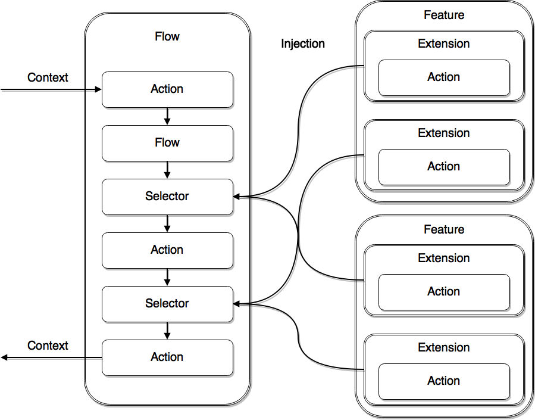

# Flower

Data-driven workflows with Java.

            <dependency>
                <groupId>com.github.xdcrafts</groupId>
                <artifactId>flower-core</artifactId>
                <version>${flower.version}</version>
            </dependency>
            <dependency>
                <groupId>com.github.xdcrafts</groupId>
                <artifactId>flower-tools</artifactId>
                <version>${flower.version}</version>
            </dependency>            
            <dependency>
                <groupId>com.github.xdcrafts</groupId>
                <artifactId>flower-spring</artifactId>
                <version>${flower.version}</version>
            </dependency>

# Terminology

* **Flow context**/**Context** - just a map with all data needed for processing.
* **Data function** - is everything matching ***Function<Map, Map>***.
* **Action** - **data function** with a name.
* **Flow** - sequence of **actions** and a way of their execution and composition. Implements **action**.
* **Selector** - extension point, that is responsible for based on **context** data selection of concrete extension implementation. Implements **action**.
* **Extension** - **action** and configuration map, that helps **selector** implementation to match this **extension**. Implements **action**.
* **Feature** - responsible for registration of **extensions** in **selectors**, stores **extension** to **selector** mapping.
* **Actor** - performs some **action** upon **context** with provided data and then deduces result of concrete type ***T***. 
* **Middleware** - named ***BiFunction<Map<String, Object>, Function<Map, Map>, Function<Map, Map>>***,
where second argument is **data-function** to modify, first argument is any kind of meta-data about that **data function**
and return value is modified **data-function**
* **Method converter** - converts supplied object into **data function**
* **Data function extracter** - extracts method from object as **data function**

### Flower entities

### Flower composition

